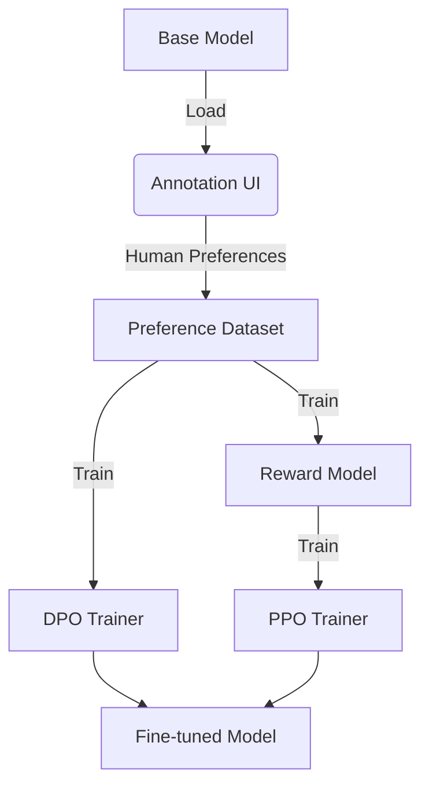

# RLHF Training Pipeline

[](https://opensource.org/licenses/MIT)
[](https://www.python.org/downloads/)
[](https://github.com/psf/black)

[](https://opensource.org/licenses/MIT)
[](https://www.python.org/downloads/)
[](https://github.com/psf/black)
[](https://colab.research.google.com/drive/1FRDL6FjOqkULM8Rzs3_Niqkws_zeOvCt)

A modular, production-ready implementation of a **Reinforcement Learning from Human Feedback (RLHF)** pipeline. This project supports the full lifecycle of RLHF: **Annotation** (Human Feedback), **DPO** (Direct Preference Optimization), and **PPO** (Proximal Policy Optimization).

## 🏗 Architecture



## 🚀 Features

- **Modular Design**: tailored for ease of use and extensibility.
- **Dual Training Modes**: Support for both DPO and PPO.
- **Interactive Annotation**: Built-in UI for collecting human feedback.
- **Configurable**: Centralized configuration for all hyperparameters.

## 📂 Directory Structure

```
rlhf-pipeline/
├── config/             # Configuration files
├── data/               # Data storage
├── notebooks/          # Jupyter notebooks for experimentation
├── output/             # Model outputs
├── scripts/            # CLI Execution scripts
├── src/                # Source code
│   ├── annotation.py   # Annotation UI logic
│   ├── config.py       # Configuration settings
│   ├── data.py         # Data processing
│   ├── models.py       # Model loading
│   ├── trainer_dpo.py  # DPO training
│   ├── trainer_ppo.py  # PPO training
│   └── utils.py        # Utilities
├── tests/              # Unit tests
├── pyproject.toml      # Project configuration & dependencies
└── README.md           # Documentation
```

## 🛠 Installation

1.  **Clone the repository:**
    ```bash
    git clone https://github.com/YOUR_USERNAME/rlhf-pipeline.git
    cd rlhf-pipeline
    ```

2.  **Install dependencies:**
    ```bash
    pip install -e ".[dev]"
    ```
    This installs the package in editable mode along with development tools.

## 🏃 Usage

### 1. Annotation
Collect human preferences for your model responses.

**CLI Mode:**
```bash
python scripts/run_annotation.py
```

### 2. DPO Training
Train the model using Direct Preference Optimization.

```bash
python scripts/run_dpo.py
```
*Output will be saved to `output/dpo_model`.*

### 3. PPO Training
Fine-tune the model using Proximal Policy Optimization.

```bash
python scripts/run_ppo.py
```

## ⚙️ Configuration

Modify `src/config.py` to change parameters such as:
- `model_name` (default: "gpt2")
- `batch_size`
- `learning_rate`
- `output_dir`

## 🚀 Deployment

### Docker
Build and run the container:
```bash
docker build -t rlhf-pipeline .
docker run -p 7860:7860 rlhf-pipeline
```

### Hugging Face Spaces
This repository is configured for easy deployment on Hugging Face Spaces using the Docker SDK.
1. Create a new Space.
2. Select **Docker** as the SDK.
3. Push this code to the Space's repository.

## 🤝 Contributing

We welcome contributions! Please see [CONTRIBUTING.md](CONTRIBUTING.md) for details on how to get started.

## 📄 License

This project is licensed under the MIT License - see the [LICENSE](LICENSE) file for details.
